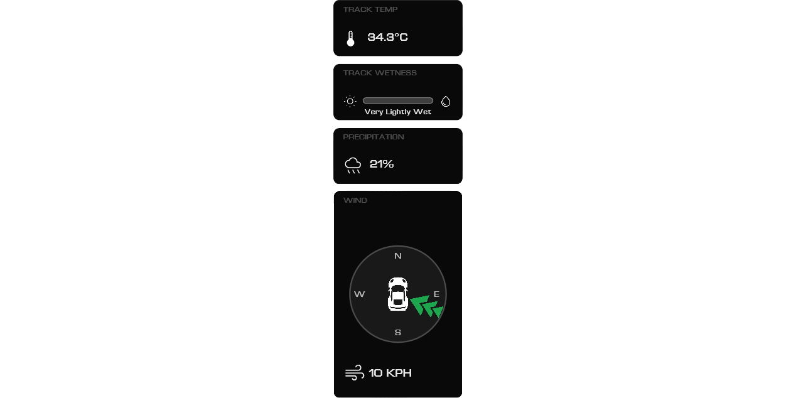
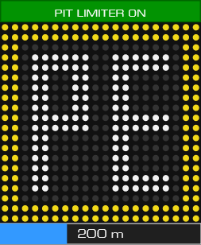

# iFL03 — modern iRacing overlays with intuitive UI <!-- omit in toc -->

iFL03 is a lightweight, modern overlay suite for iRacing. It offers a nice visual style, and a lot of customization while staying intuitive for the user.

This is a continuation of L. E. Spalt’s iRon project. Many of the core ideas, rendering scaffolding, and the overall approach to simple, dependency‑light overlays originate there. I have then greatly expanded the project to feature things I thought were missing.

So all in all a huge thanks to lespalt for the original work. iFL03 and its overlays are built upon that base. See Credits & License below.

# Contents <!-- omit in toc -->

- [Where to Download](#where-to-download)
- [What’s New in iFL03](#whats-new-in-ifl03)
- [Overlays](#overlays)
  - [Relative](#relative)
  - [Standings](#standings)
  - [DDU (Dashboard)](#ddu-dashboard)
  - [Inputs](#inputs)
  - [Delta](#delta)
  - [Flags](#flags)
  - [Weather](#weather)
  - [Track Map](#track-map)
  - [Radar](#radar)
  - [Cover](#cover)
  - [Tire](#tire)
  - [Fuel](#fuel)
  - [Pitlane](#pitlane)
- [Editing, Layout and Configuration](#editing-layout-and-configuration)
- [CEF UI](#cef-ui)
- [Installing & Running](#installing--running)
- [Building from source](#building-from-source)
- [Dependencies](#dependencies)
- [Bug reports and feature requests](#bug-reports-and-feature-requests)
- [Credits & License](#credits--license)

---

## Where to Download

- Grab binaries from this repository’s Releases page.
- Or visit my [website](https://semsodermans31.github.io/iFL03/)

---

## What iFL03 contains

The application contains many useful overlays that most people cannot go without, requesting a now overlay or feature can be done via the issues tab in GitHub or via the [Discord](https://discord.gg/D6FGc9vA) Channel.

---

## Overlays

### Relative

Competitor list centered on your car with many features:
- Position, car number, driver name
- License or SR, iRating (k notation)
- Pit age (laps since last stop) with PIT indicator when on pit road
- Last lap, delta to you, and average of last 5 laps (L5) color‑coded vs your L5
- Positions gained/lost (+/−) with color
- Buddy and flagged highlighting, optional class colors; pace car handling
- Optional minimap (relative or absolute)
- Scroll the list with the mouse wheel when there are many cars

### Standings

Full‑field view with class awareness and a compact, readable grid:
- Position, car number, driver/team name
- Pit age with live PIT indicator
- License/SR and iRating
- Car brand icon per entry (loaded from assets) when available
- Gap (time or laps), last lap, best lap (highlight class fastest), delta to you
- Average of last 5 laps (L5) color‑coded vs your own L5
- Configurable number of “top”, “ahead” and “behind” rows and auto scroll bar
- SoF, track temp, session end and laps summary footer
- Multiclass Banners that differ per class

### DDU (Dashboard)

Compact dashboard with everything you’d otherwise flip through in black boxes:
- Gear and speed, RPM shift lights and rev limiter alert
- Current lap and laps remaining (or time‑to‑go)
- Position and lap delta to leader
- Best, last, and P1’s last lap
- Delta vs session best (green/red bar)
- Session clock, incident count, brake bias
- Oil and water temperatures (C/F with warnings)
- Fuel module with: remaining fuel, per‑lap average, estimated laps left, fuel to finish, scheduled add, progress bar; auto‑filters laps under cautions or pit to keep averages clean; safety factor configurable
- Tire wear (LF/RF/LR/RR) and service indicators

### Inputs

Pedal traces and steering visualization for driving consistency work:
- Scrolling throttle and brake traces (configurable thickness/colors)
- Vertical percentage bars for clutch, brake, throttle with numeric readouts
- Steering indicator: ring + rotating column or an image wheel (Moza KS / RS v2)
- On‑wheel speed and gear when using the built‑in ring

### Delta

Circular delta with trend‑aware coloring and prediction:
- Reference modes: all‑time best, session best, all‑time optimal, session optimal, and a fallback to last lap
- Only shows once you’re on track, out of the pits, and past initial sector; hides otherwise
- Outer progress ring scales with delta magnitude (up to ±2.00s)
- Side panel shows reference lap time and predicted current lap time (reference + delta)
- Auto scales gracefully with overlay size

### Flags

High‑contrast two‑band banner for session and race control flags:
- Top band on a dark background with the flag’s color; bottom band uses the flag color as background
- Handles iRacing’s full set of flags (black/penalty, meatball/repair, red, green, yellow, white, blue, debris, crossed, start‑ready/set/go, caution variants, one/five/ten‑to‑go, disqualify, etc.)
- Preview mode lets you force a specific flag for stream layout testing

### Weather

Vertical weather pillar with clear typography and iconography:
- Track temperature with units (C/F)
- Track wetness bar (sun ←→ water) based on iRacing’s 0–7 wetness enum
- Precipitation percentage when relevant, otherwise shows air temperature
- Wind compass: car fixed in the center; arrow shows wind flow over the car (wind minus car yaw)
- Updates at a sensible cadence (weather changes are gradual)

### Track Map

Scaled track rendering with start/finish markers and cars:
- Loads normalized points from assets/tracks/track‑paths.json (by trackId)
- Auto scale/center to overlay; configurable stroke widths and colors
- Draws start/finish (and extended) lines perpendicular to the path tangent
- Self marker highlighted with number; optional opponents with class colors; pace/safety car handling
- Auto‑detect start offset when crossing S/F; manual start offset and reverse direction supported

### Radar

Proximity radar with readable distance cues:
- Circular background (optional)
- Guide lines at 8 m front/back and 2 m left/right near the car
- Yellow zones (8–2 m) and red zones (≤2 m) for front/back with subtle radial fades
- Red side zones for close lateral proximity, biased by the opponent’s along‑track location
- Sticky timers to avoid flicker as cars move in/out of thresholds

### Traffic

Modern display to inform the user of different class vehicles behind them.
- shows the class, car number and brandname
- also displays distance behind in time and meters or feet

### Cover

Plain rectangle that can hide distracting in‑car dashes (e.g., next‑gen stock car). Useful for broadcasts and focused driving.

Screenshot: (not applicable)

## Tire
Shows tire data from iRacing SDK, a limitation is that this is only static and gets updated if you drive into your pitbox and out again.

## Fuel
Displays live fueldata in a comprehensive view. Able to edit the value for extra fuel that is calculated is possible if you are a good fuel saver and feel like the data is inaccurate.

## Pitlane
Displays handy information when driving into the pitlane.
- On pit entry/exit, it tells you when to engage pitlimiter
- In pitlane it shows speed and distance to pitbox

---

## Editing, Layout and Configuration using the GUI

- Preview Mode: In the settings in the GUI toggle the switch on.
- Hotkeys: Overlays can be toggled at runtime (see overlays menu for hotkey combination). Hotkeys are configurable.
- Live config: Most colors, fonts, sizes and behavior can be tuned in the generated config.json if you wish to totally customize your experience, this requires a bit of technical knowhow :P. Edits are applied live when you save.

---

## CEF Settings UI

iFL03 ships with an embedded Chromium UI for a friendlier setup experience. Use it to:
- Toggle overlays on/off and adjust per‑overlay options
- Change fonts, sizes, spacing and colors
- Preview and fine‑tune positions and global opacity

If you prefer, all settings remain available via config.json without opening the UI.

---

## Installing & Running

- Install via the installer in the releases tab please do this in any writable folder (so iFL03 can save config.json).
- Run iFL03 before or after launching iRacing; overlays will appear once you’re in the car and standings as you are in the menu.
- Borderless‑window mode in iRacing is recommended. Other modes may work but are less tested.

---

## Building from source

Prerequisits:
- Visual Studio 2022
- CEF can be downloaded [here](https://cef-builds.spotifycdn.com/cef_binary_144.0.12%2Bg1a1008c%2Bchromium-144.0.7559.110_windows64.tar.bz2)
- You may need the standard DirectX SDK components that ship with Visual Studio.

- Unzip the CEF folder, rename it to simply (cef_full_buildnumber for example /cef_binary_139.0.17+g6c347eb+chromium-139.0.7258.31_windows64) and place it somewhere you can read and write to it.
- create a seperate folder next to the cef_buildnumber folder named cef_build. Then run the following CMake command:
    `cmake -S "C:\YOUR_PATH\cef\cef_full_buildnumber" -B "C:\YOUR_PATH\cef\cef_build" -G "Visual Studio 17 2022" -A x64 -DCEF_RUNTIME_LIBRARY_FLAG=/MD`
- This creates a cef.sln inside the cef_build folder. After, run the following command to create a build from the cef.sln:
    `cmake --build "C:\YOUR_PATH\cef\cef_build" --config Release --target libcef_dll_wrapper
- Now you have created the necessary cef files to run the project. 
- In the project repo after opening and running the ifl03.sln file. It creates a Release folder. In this folder add the following files from the cef/cef_full_buildnumber/Release:
  - libcef.dll
  - chrome_elf.dll
  - v8_context_snapshot.bin
- This now should allow you to build the overlay application from Visual Studio 2022 in Release mode.

---

## Dependencies

- Runtime: Only standard Windows components (Direct3D/Direct2D, DirectWrite, etc.).
- Source: iRacing SDK, picojson, and minimal helper code included in this repository.

---

## Bug reports and feature requests

Please open an issue in this repository. Reproduced steps and logs/screenshots help a lot, same goes for feature requests. I will try to implement all features requested if they are a logical improvement to the overlay application.

---

## Credits & License

- iFL03 is based on iRon by L. E. Spalt (lespalt). The rendering architecture and many overlay ideas come from that project. The CEF GUI builds on that foundation. Thank you!
- License: MIT (see LICENSE). Please retain copyright notices in source files.

## Donations

If you like this project enough to wonder whether you can contribute financially: first of all, thank you! Make sure to also checkout lesphalt's repo/github to show some appreciation. you can support me (only if you really want to) using this [link](https://paypal.me/sems0drmans). If not **please 
consider giving to any charities of your choosing instead**.
